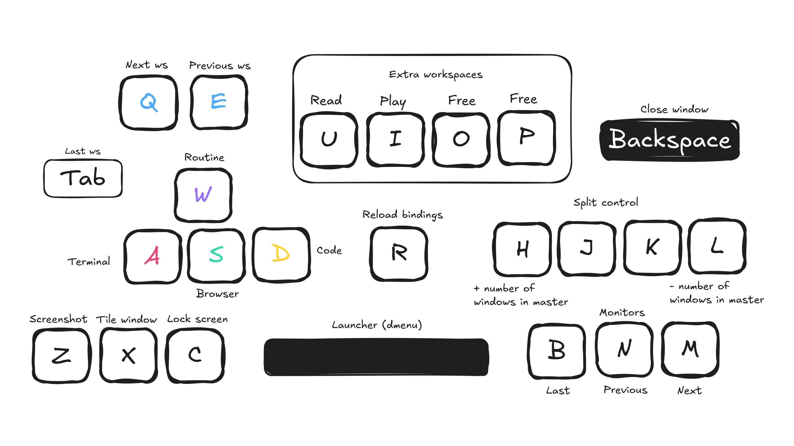
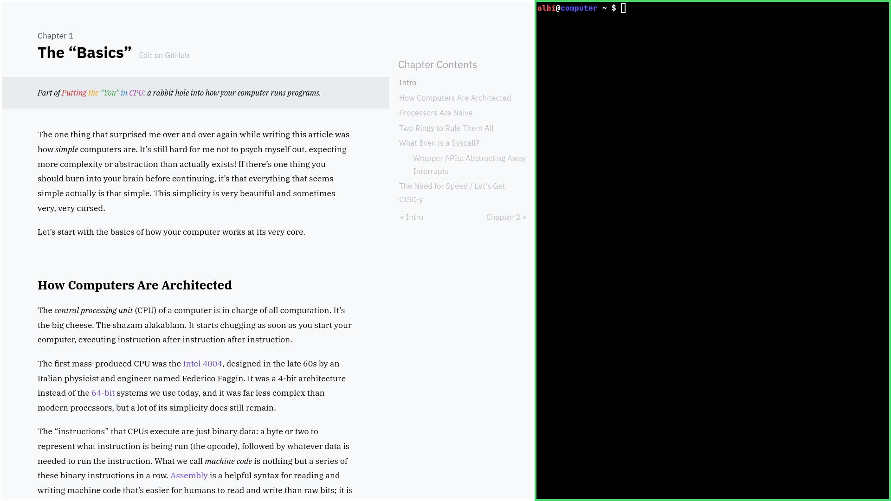
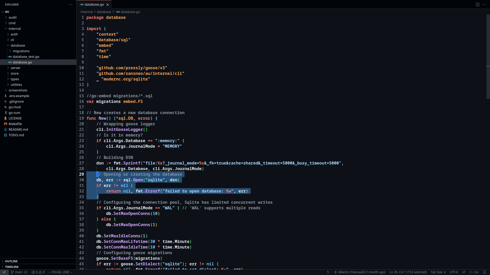

# prime
> Dotfiles for a comfy and distraction-free setup

```
 ______   ______     __     __    __     ______    
/\  == \ /\  == \   /\ \   /\ "-./  \   /\  ___\   
\ \  _-/ \ \  __<   \ \ \  \ \ \-./\ \  \ \  __\   
 \ \_\    \ \_\ \_\  \ \_\  \ \_\ \ \_\  \ \_____\ 
  \/_/     \/_/ /_/   \/_/   \/_/  \/_/   \/_____/ 

```

I need a system that:  
* Gets me to my goals (passing exams, shipping and excelling at my craft over time).
* Is minimal (and kind of elitist)[^1] with a well defined and effective toolset.
* Has low overhead once it clicks and builds little fatigue while using it[^2].
* Takes no time installing, can be[^3] secure and has no big corpo telemetry.

Is that you[^4]? Great! Then read the rest.

## Builds
There are three builds available based off the latest Void Linux x86_64-glibc.
* Headless (`headless-prime.iso`), the toolset plus the drivers, nothing else.
* Safe (`safe-xorg-prime.iso`), everything headless has plus audio, bluetooth, fonts, everything graphics and various applications.
* Performance (`performance-xorg-prime.iso`), exactly like safe, but with unsecure kernel boot options for a performance increase up to 20%!

> [!CAUTION]
> Using performance your system will be vulnerable to Meltdown and a lot more, but unless there's someone else on your computer doing binary exploitation or process hacking, you are probably good.

Let's get into it!

## Toolset
* linux and kmod: kernel and modules
* dracut: generate initramfs
* runit: init system
* agetty: manage ttys
* glibc: libc
* efibootmgr: manage uefi boot entries
* os-prober: detect other operating systems
* kbd: keyboard utilities (ttys)
* gettext: localization utilities
* usbutils: usb utilities
* bash and dash: user and system shell
* zellij: multiplexer
* atool (supporting gzip, tar, xz, 7zip, unzip and unrar): archive and unarchive
* util-linux: system utilities
* procps-ng: processes utilities
* coreutils: core utilities
* findutils: find utilities
* grep: pattern matching
* sed: stream editor
* less: pager
* e2fsprogs, btrfs-progs and xfsprogs: ext4, btrfs, xfs disk utilities
* f2fs-tools, dosfstools and exfat-utils: fat and exfat utilities
* ntfs-3g: ntfs disk utilities
* sudo: privilege escalation
* shadow: users and groups
* ed: standard editor
* ex/vi: visual editor
* vim: improved visual editor
* xxd: format in octal, hexadecimal and binary
* file: detect file type
* which: show full command path
* bc: basic calculator
* man and texinfo: read documentation
* xbps and vpm: manage packages
* ethtool: query and control network driver and hardware
* openssl: cryptography
* curl: send http and socks requests
* trurl: parse and manipulate urls
* jq: json processor
* traceroute: follow network packets
* iproute2 and iputils: network utilities
* wget: http and ftp download utility
* yt-dlp: download videos
* acpid: handle acpi events
* eudev: device manager
* ntp and chrony: time synchronization
* iw, iwd and wpa_supplicant: wifi
* iptables and ip6tables: firewall
* openssh: secure remote shell
* cronie: cron implementation
* dhcpcd: dhcp client
* tlp and tlp-rdw: power management
* docker, docker-buildx and docker-compose: containers
* android-tools and scrcpy: mobile devices

### Development
* asm/c
  * binutils: binary utilities
  * bison: parser generator
  * flex: lexer
  * m4: macro processor
  * make: build system
  * autoconf and automake: portable software builds
  * pkg-config: retrieve information about installed libraries
  * gcc: compiler collection
  * gdb: debugger
  * strace: trace syscalls
  * ltrace: trace library calls
  * rizin: binary exploitation, process hacking and reverse engineering
* gawk: awk implementation
* go: compiled garbage collected language
* python: runtime object oriented language
* gleam: runtime functional language
* sqlite: embeddable sql database
* troff, groff and typst: typesetting
* diffutils: diff utilities
* patch: patch source files
* git and github-cli: version control system

### Xorg
* acpid: power management
* dbus: message bus system 
* elogind: user logins and seats
* polkit: policy framework
* pipewire, wireplumber and wiremix: audio
* bluez: bluetooth
* xorg and xinit: display server
  * xrandr: manage monitors
  * xinput and setxkbmap: configure mouse and keyboard (xorg)
  * xclip: clipboard
  * xprop: display window properties
  * xset: change display server properties
* noto (including cjk and emojis), jetbrains and mononoki: fonts
* dk: window manager
* sxhkd: hotkey daemon
* dmenu: launcher
* scrot: screenshot
* xautolock and sclok: lock screen
* xwallpaper: set wallpaper
* ranger: file manager
* nsxiv: view images
* ffmpeg: play (and manipulate) audios and videos
* zathura (supporting pdf, epub, xps, cbz, cbr, cb7 and cbt): read documents

#### Apps
* vscode: graphical editor
* qutebrowser: web browser
* signal: chat
* qbittorrent: torrent client
* nicotine: soulseek client
* obs: record and live stream
* cutter: rizin frontend
* flatpak: self-contain applications
  * rustdesk: remote desktop
  * heroic: play native and windows games using proton
  * melonds: play nintendo ds games by emulating them
  * ryujinx: play nintendo switch games by emulating them

### Documentation
* [GNU](https://www.gnu.org/manual/manual.html)
* [Linux](https://kernel.org)
* [Vim](https://vimhelp.org)
* [Rizin](https://rizin.re)
* [Go](https://go.dev)
* [Python](https://docs.python.org/3)
* [Gleam](https://gleam.run)
* [Sqlite](https://sqlite.org)
* [Typst](https://typst.app/docs)
* [Git](https://git-scm.com/docs)
* [GitHub](https://docs.github.com)
* [Caddy](https://caddyserver.com)
* [Docker](https://docs.docker.com)
* [Kubernetes](https://kubernetes.io/docs/home)
* [Traefik](https://doc.traefik.io/traefik/)
* [Amazon Web Services](https://docs.aws.amazon.com)
* [Tencent Cloud](https://www.tencentcloud.com/document/product)
* [Hashicorp](https://developer.hashicorp.com)
* [Pulumi](https://www.pulumi.com)
* [Grafana](https://grafana.com)
* [Void Linux](https://voidlinux.org)
* [Manned](https://manned.org)

#### Additional
* [Zellij](https://zellij.dev/documentation)
* [VSCode](https://code.visualstudio.com/docs)
* [Qutebrowser](https://qutebrowser.org/doc/help/index.html)
* [Cutter](https://cutter.re)
* [Heroic](https://heroicgameslauncher.com)

Take a look at the highly curated [quickmarks](xorg/etc/skel/.config/qutebrowser/quickmarks)!

> [!TIP]
> Offline?
> Use `man` to access manual pages.  
> Use `info` to access GNU documentation system.

Don't use fucking AI[^5] whenever you can't understand something.

## Screenshots




Is it supposed to look pretty?   
That's not the point, but I'm happy it does!

## Keybindings
Read [TABLE.md](./TABLE.md).

Modify `~/.filter` to choose which applications are listed in the filtered launcher.

## Installation
1. Boot it up and run `sudo void-installer`, follow the process and done 🎉!  
You know how to partition and where to mount stuff, you are a big boy/girl.

> [!TIP]
> Make sure to pick the right services and groups.

2. Now log into your new system and get the remaining drivers.

> [!NOTE]
> Some of these might already be installed.  
> Better safe than sorry!

CPU microcode
```sh
# For Intel CPUs
vpm install linux-firmware-intel
# For AMD CPUs
vpm install linux-firmware-amd
```

GPU drivers
```sh
# For AMD GPUs
vpm install mesa-vulkan-radeon xf86-video-amdgpu xf86-video-ati
# For Nvidia GPUs
vpm install nvidia nvidia-vaapi-driver nvidia-docker
# For Intel GPUs
vpm install intel-video-accel intel-media-driver
```

3. Make sure your `.xinitrc` is just the way you want it!

You might also want to place your `.gitconfig`!
```ini
[user]
  email = sansneolink@gmail.com
	name = Alberto Chiaravalli
	signingkey = ~/.ssh/sign.pub
[gpg]
	format = ssh
[commit]
	gpgsign = true
[init]
	defaultBranch = main
[pull]
	rebase = true
```

Edit `/etc/dhcpcd.conf` to specify your preferred DNS servers (by default, Cloudflare’s DNS are used).  
To prevent dhcpcd from overwriting your `/etc/resolv.conf`, uncomment `nohook resolv.conf`.  
To use your gateway's default DNS server, comment `nooption domain_name_servers` and `nooption rdnss`.

4. Install the VSCode extensions required by the configuration
```
code --install-extension github.github-vscode-theme
code --install-extension vscodevim.vim
code --install-extension ms-vscode.cpptools
code --install-extension golang.go
code --install-extension ms-python.python 
code --install-extension gleam.gleam
```

## Flatpaks
Add the Flathub remote
```sh
sudo flatpak remote-add --if-not-exists flathub https://flathub.org/repo/flathub.flatpakrepo
```
Install the flatpaks
* RustDesk
```sh
sudo flatpak install com.rustdesk.RustDesk
```
* Heroic
```sh
sudo flatpak install com.heroicgameslauncher.hgl
sudo flatpak override --nofilesystem=~/Games/Heroic com.heroicgameslauncher.hgl
sudo flatpak override --filesystem=~/games com.heroicgameslauncher.hgl
```
* MelonDS
```sh
sudo flatpak install net.kuribo64.melonDS
```
* Ryujinx
```sh
sudo flatpak install io.github.ryubing.Ryujinx
```

> [!TIP]
> Signal is my preferred platform to text and call with friends, it's open source, secure and to the point.  
> This isn't installed as a Flatpak, you can find it as `Signal-Desktop` in the repositories.  
> My Instagram is mostly a face thing, I don't really use it.

## Building

> [!WARNING]
> It's recommended to do this on a Void Linux installation with `qemu-user-static`.

1. Clone the repo
```
git clone https://github.com/sansneo/prime
cd prime
```
2. Update the submodule
```
git submodule update --init --remote
```
3. Become root
```
su
```
4. Run `build.sh`
```
sh build.sh
```

This is gonna take a while...  
You'll find the resulting files in `build/`.  
To learn more, take a look at `build.sh` and refer to [void-linux/void-mklive](https://github.com/void-linux/void-mklive).

### Conclusion
I love my computer! Do you?   

Please, get the fuck out of IT if you are here [for the money](https://geohot.github.io/blog/jekyll/update/2025/09/13/get-out-of-technology.html).  
Because of the [state of the world](https://www.slickcharts.com/sp500) there's a lot of money to be made here if you actually care about doing something real and creating value by making infrastructures and computers better.  
Personally, I really enjoy everything systems programming, secure backend development and the cloud (this last one is known to be extremely remunerative), so I'll be doing that.  
As time passes I look up to legends such Rob Pike, Russ Cox and George Hotz more and more.  
I am 22 years old at the time of writing this, in my 30s I'll have a pretty good understanding of my toolset and computers in general, then hopefully, in my 40s I'll be able to compare to them.

Thanks to computers I have the knowledge.  
Thanks to luck I have the genetics.   
What's stopping me?  

Life can be beautiful (even if it can definitely feel dark at times), self-improvement is the best and my drive will never stop. I believe in you, dear reader. 

We won't stand for mediocrity.

# Footnotes
[^1]: Yes, this is a Linux kernel with the GNU userspace plus a lot more meaning complexity is gonna be pretty high compared to something like OpenBSD or Plan 9, but I can't compromise on functionality and focusing on the toolset alone, it's really not that bad given you have 20 years to spare, point is, it's doable and cool!

[^2]: This is the true enemy we face as developers, we need to reduce overhead and that mental fatigue that slowly builds while we work!
  Here's a video from [The Primeagen](https://www.youtube.com/watch?v=ZH3iKbEiks0) I really liked which touches on the topic.

[^3]: The performance build is not trying to be crazy secure, the safe build has the Void Linux kernel hardening, if you use a modern CPU on a non-core/libre (meaning modern basically) system, if you are holding a non-rooted phone with Google services running on it (meaning you are a normal person), if you often use something like Discord (eww) or play video-games like Valorant (maybe try something single-player or fun with friends) or Rainbow Six Siege that have a kernel-level anti-cheat running, your super secure private hacker ideological setup starts to look cringey. This system is secure and practical in all the right ways in my opinion.

[^4]: You can't use prime unless you bench at least 60kg and are really hot.

[^5]: Come on, really? Up until AIs can write a complete authentication API that's not vulnerable to BOLA, CSRF or anything else in the API OWASP TOP-10 I will use it very rarely and ask questions I know are common knowledge, it does not work for anything really niche, at least for now.