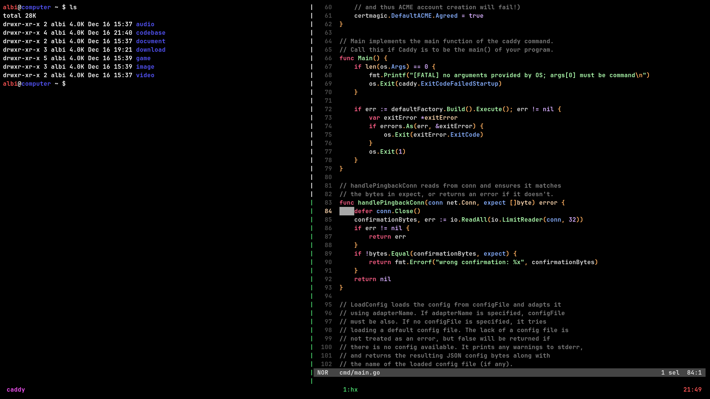

# prime
> For a masterable, comfy and distraction-free setup!

```
 ______   ______     __     __    __     ______    
/\  == \ /\  == \   /\ \   /\ "-./  \   /\  ___\   
\ \  _-/ \ \  __<   \ \ \  \ \ \-./\ \  \ \  __\   
 \ \_\    \ \_\ \_\  \ \_\  \ \_\ \ \_\  \ \_____\ 
  \/_/     \/_/ /_/   \/_/   \/_/  \/_/   \/_____/ 

```

I need a system that:  
* Gets me to my goals (passing exams, shipping and excelling at my craft over time).
* Is minimal[^1] (and kind of elitist) with a well defined and effective toolset.
* Has low overhead once it clicks and builds little fatigue while using it[^2].
* Takes no time installing, can be[^3] secure and has no big corpo telemetry.

Is that you[^4]? Great! Then read the rest.

## Builds
There are four builds available, all of which are based on the latest Void Linux x86_64-glibc.
* Headless (`headless-prime.iso`), the toolset plus the drivers, almost nothing else.
* Safe (`safe-xorg-prime.iso`), everything headless has plus audio, bluetooth,  
fonts, everything graphics and various applications.
* Performance (`performance-xorg-prime.iso`), just like safe, but using insecure kernel boot  
options for a performance increase up to 20%!
* Personal (`personal-xorg-prime.iso`), performance with very opionionated additions such as VSCode.

> [!CAUTION]
> Your system will be vulnerable to Meltdown and a lot more if you choose to use performance, but unless someone is on your computer doing binary exploitation and process hacking,
you are probably good.

Let's get into it!

## Headless
Packages are (mostly) organized by the following priority order:  
`Kernel > Shell > Userland (non‑network) > Userland (network) > Daemons` and  
within each priority, grouped by origin: `Linux project > GNU project > Other projects`.

Pure driver packages are not listed, but are installed as part of the system and very much essential.

### Toolset
* linux and kmod: kernel and modules
* dracut: generate initramfs
* grub: bootloader
* efibootmgr: manage uefi boot entries
* os-prober: detect other operating systems
* runit: init system
* glibc: libc
* bash and dash: user and system shell
* tmux: multiplexer
* tmate: share terminal
* skim: fuzzy finder
* usbutils: usb utilities
* util-linux: system utilities
* procps-ng: process utilities
* coreutils: core utilities
* findutils: find utilities
* grep: pattern matching
* sed: stream editor
* less: pager
* man and texinfo: read documentation
* atool (supporting gzip, tar, xz, 7z, zip and rar): archive and unarchive
* e2fsprogs, btrfs-progs and xfsprogs: ext4, btrfs, xfs disk utilities
* f2fs-tools, dosfstools and exfat-utils: fat and exfat utilities
* ntfs-3g: ntfs disk utilities
* sudo: privilege escalation
* shadow: users and groups
* xxd: format in octal, hexadecimal and binary
* helix: modern editor
* which: show full command path
* file: detect file type
* xbps and vpm: manage packages
* android-tools and scrcpy: mobile devices
* ethtool: query and control network driver and hardware
* openssl: cryptography
* curl: send http and socks requests
* trurl: parse and manipulate urls
* jq: json processor
* traceroute: follow network packets
* iproute2 and iputils: network utilities
* wget: http and ftp download utility
* yt-dlp: download videos
* openssh: secure remote shell
* acpid: handle acpi events
* eudev: device manager
* agetty: manage ttys
* cronie: cron implementation
* ntp and chrony: time synchronization
* dhcpcd: dhcp client
* iw and iwd: wifi
* iptables and ip6tables: firewall
* tlp and tlp-rdw: power management
* docker, docker-buildx and docker-compose: containers

### Languages
* asm/c
  * binutils: binary utilities
  * bison: parser generator
  * flex: lexer
  * m4: macro processor
  * make: build system
  * autoconf and automake: portable software builds
  * pkg-config: retrieve information about installed libraries
  * gcc: compiler collection
  * gdb: debugger
  * strace: trace syscalls
  * ltrace: trace library calls
  * rizin: binary exploitation, process hacking and reverse engineering
* gawk: awk implementation
* go: compiled garbage collected language
  * delve: debugger
* python: runtime object oriented language
* gleam: runtime functional language
* sqlite: embeddable sql database
* typst, troff and groff: typesetting
* diffutils: diff utilities
* patch: patch source files
* git and github-cli: version control system
* protobuf: protocol buffers

### Additional
Packages that are not part of the toolset, but are included in headless.
* kbd: keyboard utilities (ttys)
* gettext: localization utilities
* bc: basic calculator
* ed: standard editor
* nvi: visual editor

## Xorg
* dbus: message bus system 
* elogind: user logins and seats
* polkit: policy framework
* pipewire, wireplumber and wiremix: audio
* bluez: bluetooth
* xorg and xinit: display server
  * xrandr: manage monitors
  * xinput and setxkbmap: configure mouse and keyboard (xorg)
  * xclip: clipboard
  * xprop: display window properties
  * xset: change display server properties
* noto (including cjk and emojis): system fonts
* jetbrains mono, 0xproto, commit mono and mononoki: programming fonts
* dk: window manager
* sxhkd: hotkey daemon
* dmenu: launcher
* scrot: screenshot
* xautolock and slock: lock screen
* xwallpaper: set wallpaper
* ranger: file manager
* nsxiv: view images
* mpv: play audios and videos
* ffmpeg: manipulate audios and videos
* zathura (supporting pdf, epub, xps, cbz, cbr, cb7 and cbt): read documents

### Apps
* qutebrowser: browser
* obs: record and live stream
* qbittorrent: torrent
* cutter: rizin frontend
* flatpak: self-contain applications

In addition to the drivers, language servers, linters, and formatters some languages are also installed.

### Documentation
* [GNU](https://www.gnu.org/manual/manual.html)
* [Linux](https://kernel.org)
* [Helix](https://helix-editor.com)
* [Curl](https://curl.se/docs/tutorial.html)
* [Jq](https://jqlang.org)
* [Rizin](https://rizin.re)
* [Go](https://go.dev)
* [Python](https://docs.python.org/3)
* [Gleam](https://gleam.run)
* [SQLite](https://sqlite.org)
* [Typst](https://typst.app/docs)
* [Git](https://git-scm.com/docs)
* [GitHub](https://docs.github.com)
* [Caddy](https://caddyserver.com)
* [Docker](https://docs.docker.com)
* [Kubernetes](https://kubernetes.io/docs/home)
* [Traefik](https://doc.traefik.io/traefik/)
* [Amazon Web Services](https://docs.aws.amazon.com)
* [Tencent Cloud](https://www.tencentcloud.com/document/product)
* [HashiCorp](https://developer.hashicorp.com)
* [Pulumi](https://www.pulumi.com)
* [Grafana](https://grafana.com)
* [Void](https://voidlinux.org)
* [Manned](https://manned.org)

Check out the highly curated [quickmarks](./xorg/etc/skel/.config/qutebrowser/quickmarks) for more!

> [!TIP]
> Offline?
> Use `man` to access manual pages.  
> Use `info` to access GNU documentation system.

Don't use fucking AI[^5] whenever you can't understand something.

## Screenshots



Is it supposed to look this pretty?   
That's not the point, but I'm happy it does!

Check out the [bindings](./KEYBOARD.md)

## Installation
1. Boot it up and run `sudo void-installer`, follow the process and done 🎉!  
You know how to partition and where to mount stuff, you are a big boy/girl.

> [!TIP]
> Make sure to pick the services and groups you want!

2. Now log into your new system and get the remaining drivers.

> [!NOTE]
> Some of these might already be installed.  
> Better safe than sorry!

CPU microcode
```sh
# For Intel CPUs
vpm install linux-firmware-intel
# For AMD CPUs
vpm install linux-firmware-amd
```

GPU drivers
```sh
# For AMD GPUs
vpm install mesa-vulkan-radeon xf86-video-amdgpu xf86-video-ati
# For Nvidia GPUs
vpm install nvidia nvidia-vaapi-driver nvidia-docker
# For Intel GPUs
vpm install intel-video-accel intel-media-driver
```

3. Lastly, make sure your `~/.xinitrc` is just the way you want it!

### Tips
I recommend giving a shot to [Qutebrowser](SEARCH.md), but if you want to use something Chromium or Firefox based check out the [Bitwarden](https://addons.mozilla.org/en-US/firefox/addon/bitwarden-password-manager),
[uBlock Origin](https://addons.mozilla.org/en-US/firefox/addon/ublock-origin), [YouTube Unhook](https://addons.mozilla.org/en-US/firefox/addon/youtube-recommended-videos) and
[No More Gemini](https://addons.mozilla.org/en-US/firefox/addon/no-more-gemini) extensions!

Don't forget to install your `~/.gitconfig` and `~/.ssh` keys!
```ini
[user]
  email = sansneolink@gmail.com
	name = Alberto Chiaravalli
	signingkey = ~/.ssh/sign.pub
[gpg]
	format = ssh
[commit]
	gpgsign = true
[init]
	defaultBranch = main
[pull]
	rebase = true
```

Edit `/etc/dhcpcd.conf` to specify your preferred DNS servers (by default, Cloudflare's DNS is used).   
To prevent dhcpcd from overwriting your `/etc/resolv.conf`, uncomment `nohook resolv.conf`.  
To use your gateway's default DNS server, comment `nooption domain_name_servers` and `nooption rdnss`.

Remove the default Helix themes to keep exlusively my selection.
```sh
sudo rm -r /usr/lib/helix/runtime/themes
```

Install goimports (not in the repositories) for on-format automatic imports with Go.
```sh
go install golang.org/x/tools/cmd/goimports@latest
```

You can run the `kubectl`, `aws-cli` and `terraform` as Docker containers.  
This requires the containerd and docker services to be running.

### Flatpaks
To get some, add the Flathub remote
```sh
sudo flatpak remote-add --if-not-exists flathub https://flathub.org/repo/flathub.flatpakrepo
```
then
```sh
# To install Heroic, for example
sudo flatpak install com.heroicgameslauncher.hgl
# Override application permissions
sudo flatpak override --nofilesystem=~/Games/Heroic com.heroicgameslauncher.hgl
sudo flatpak override --filesystem=~/games com.heroicgameslauncher.hgl
```

### Gaming
* heroic : play native and windows games with proton
* duckstation: play ps1 games through an emulator
* xemu: play the original xbox games through an emulator
* mgba: play nintendo gba games through an emulator
* melonds: play nintendo ds games through an emulator
* cemu: play nintendo wiiu games through an emulator
* ryujinx: play nintendo switch games through an emulator

> [!NOTE]
> I don't really play anymore, but it's super cool that almost every game runs flawlessly with no setup required on Linux now.  
> One limitation is (usually competitive) multiplayer games with kernel level anti-cheats.  
> Honestly, it might be better this way.  
> Heroic can install pirated[^6] games by first running Warez scene installers.

## Building
> [!WARNING]
> Do this on a Void Linux with `qemu-user-static`, `curl` and `wget` installed.

1. Clone the repo
``` git clone https://github.com/sansneo/prime
cd prime
git submodule update --init --remote
```
2. Become root and run `build.sh`
```
su
sh build.sh
```

This will take a while...  
The resulting files will be available in `build/`.  
To learn more, take a look at `build.sh` and refer to [void-linux/void-mklive](https://github.com/void-linux/void-mklive).
 
### Conclusion
I love my computer! Do you?   

Please, [get the fuck out of technology](https://geohot.github.io/blog/jekyll/update/2025/09/13/get-out-of-technology.html) if you are here for the money.  
Because of the [state of the world](https://www.slickcharts.com/sp500) there's a lot of that to be made here if you actually care about doing something real and
creating value by making infrastructures and computers better instead of just moving data around.  

I really enjoy everything systems programming, secure backend development and cloud, so I'll be doing that.  
As time passes I look up to legends such as Rob Pike, Russ Cox and George Hotz more and more.  
I am 22 years old at the time of writing this, in my 30s I'll have a pretty good understanding of my toolset and computers in general, then hopefully,
in my 40s I'll be able to compare to them.

Thanks to computers, I have the knowledge.  
Thanks to luck, I have the genetics.   
What's stopping me?  

Life can be beautiful (even if it definitely can feel dark at times), self-improvement is the best and my drive for doing what I do will forever grow.
I believe in you, dear reader. 

We won't stand for mediocrity.

P.S.
My Instagram is mostly a face thing and way too distracting for me to actually use.  
Write me an email or ask me to add you on WhatsApp <3.
Thanks for reading!

# Footnotes
[^1]: Yes, this is a Linux kernel with the GNU userspace plus a lot more meaning complexity is gonna be pretty high compared to something like OpenBSD or Plan 9, but I can't
compromise on functionality and focusing on the toolset alone, it's really not that bad given you have 20 years to spare, point is, it's doable!

[^2]: This is the real enemy we face as developers, we need to reduce overhead and that mental fatigue that slowly builds while we work!
  Here's a video from [The Primeagen](https://www.youtube.com/watch?v=ZH3iKbEiks0) I really liked which touches on the topic.

[^3]: The performance build is not trying to be crazy secure, the safe build has the Void Linux kernel hardening, if you use a modern CPU on a
  non-core/libre (meaning modern basically) system, if you are holding a non-rooted phone with Google services running on it (meaning you are a normal person),
  if you often use something like Discord (eww) or play video games like Valorant (maybe try something single-player or fun with friends) or Rainbow Six Siege that have a
  kernel-level anti-cheat running, your super secure private hacker ideological setup starts to look cringey. This system is secure and practical in all the right ways in my opinion.

[^4]: You can't use prime unless you bench at least 60kg and are really hot.

[^5]: Come on, really? Up until AIs can write a complete authentication API that's not vulnerable to BOLA, CSRF or anything else in the API OWASP TOP-10
I will use it very rarely and ask questions I know are common knowledge, it does not work for anything really niche and overly specific, at least for now.

[^6]: In a world where so many companies do not care about quality of product as compared to the monetary game, you need to use like 7 different
  subscription based streaming platforms to watch a whole show and AAA game studios often shit out low effort games at full price, I believe it's totally fair to pirate things.
  Keep a list of the media you love, shows, games and music you didn't pay for (knowledge shouldn't be paywalled and there's great value there), then give back once rich.  
  Counter argument, what if everyone does this? Most people are just not technical enough, be grateful you are and enjoy!
